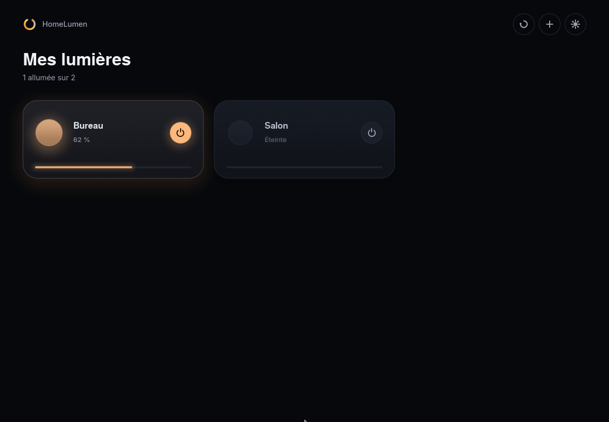
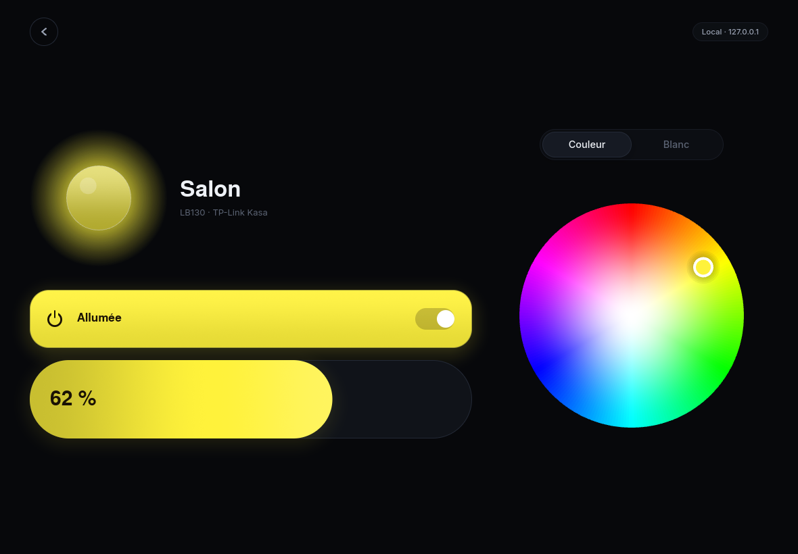

<div align="center">

[](LICENSE)
[](https://github.com/Victor-root/HomeLumen/commits/main)
[](Cargo.toml)

[](#sous-windows)
[](#sous-linux)
[](crates/homelumen-app/src/design/text.rs)
[](crates/)

</div>

<div align="center">


# HomeLumen

**Une application de bureau pour piloter ses éclairages et ses prises
connectées, écrite entièrement en Rust.**

Windows 11 et Linux · Trois écrans, pas plus

</div>

---

## 📸 Captures d'écran

<p align="center">
  
  
</p>

<p align="center"><sub>La liste des lumières, puis une lumière. Les contrôles affichés dépendent uniquement de ce que l'appareil sait faire.</sub></p>

---

## ✨ Fonctionnalités

- 🔌 **Pilote TP-Link Kasa** en réseau local (séries LB et KL, dont les LB120 et LB130)
- 🔗 **Pilote Tuya / Smart Life** pour les prises connectées, via le compte du fabricant
- 🗂️ **Lumières et prises séparées** en deux onglets, jamais mélangées
- 📡 **Découverte automatique** par diffusion UDP sur toutes les interfaces, plus ajout manuel par adresse
- 🎛️ **Contrôles complets** : marche/arrêt, luminosité, couleur, blanc chaud/froid
- 🌗 **Thème sombre et clair**
- 🌍 **Anglais et français**, la langue du système est détectée automatiquement
- 🖌️ **Tout est dessiné à la main** : aucune police d'icônes, aucune image, chaque tracé est un vecteur calculé

---

## 🔒 Vie privée

Pas de télémétrie, pas de compte HomeLumen, pas de serveur qui nous
appartienne : l'application ne parle qu'aux appareils et, le cas échéant, au
fabricant de ceux qui l'exigent.

Les lumières Kasa restent entièrement sur le réseau local (route `Lan`) :
rien ne sort de chez vous. Les prises Tuya, elles, passent par les serveurs
de Tuya (route `Cloud`), parce que leur pilotage local demande une clé que
seul le compte du fabricant délivre. C'est le compromis assumé de cette
route, et elle ne s'active que si vous avez renseigné vos codes Tuya dans
les réglages. Ces codes ne quittent jamais votre machine autrement que pour
signer vos propres requêtes vers Tuya ; ils sont rangés dans un fichier
lisible par votre seul compte utilisateur.

---

## 🚀 Compiler et lancer

Il faut [Rust](https://rustup.rs) (édition 2024, `rustc` 1.85 ou plus récent).
Sous Windows, les outils de compilation C++ de Visual Studio sont nécessaires,
comme pour tout projet Rust.

```
cargo run --release
```

L'exécutable se retrouve dans `target/release/`.

### 🪟 Sous Windows

> [!TIP]
> La découverte automatique repose sur une diffusion UDP. Le pare-feu Windows
> bloque souvent la réponse des ampoules tant qu'aucune règle n'existe pour
> l'application. Deux solutions :
>
> - autoriser HomeLumen dans le pare-feu quand Windows le propose ;
> - ou utiliser le bouton **+** de l'en-tête pour saisir l'adresse locale de
>   l'ampoule, ce qui emprunte exactement le même pilote.

`cargo build --release` donne un exécutable autonome (police et icône sont
embarquées dedans), qui marche tel quel sans rien installer. Pour un vrai
installateur à la place (dossier dans Program Files, raccourcis menu Démarrer
et bureau, désinstallation depuis Windows), c'est le même outillage cargo qui
s'en charge, pas une application séparée à ouvrir et où cliquer : une fois

```
cargo install cargo-packager --locked
```

installé, il suffit de

```
cargo packager --release
```

cargo-packager télécharge lui-même NSIS au premier lancement, recompile
HomeLumen et construit l'installateur en une seule commande. Il sort dans
`target/release/homelumen_<version>_x64-setup.exe`.

Pour construire ce même installateur depuis Linux ou WSL (utile pour le
vérifier sans machine Windows sous la main), il faut en plus le compilateur
croisé et NSIS en local (`sudo apt install mingw-w64 nsis`, puis
`rustup target add x86_64-pc-windows-gnu` une fois) :

```
cargo packager --release --target x86_64-pc-windows-gnu
```

Le nom, l'éditeur, l'icône et les langues de l'installateur se règlent dans
`crates/homelumen-app/Cargo.toml`, sous `[package.metadata.packager]`.

### 🐧 Sous Linux

> [!NOTE]
> HomeLumen dessine avec `wgpu` et a donc besoin d'un pilote graphique
> fonctionnel (Vulkan, ou OpenGL via Mesa). Sur une machine sans accélération
> du tout, iced bascule sur son moteur logiciel, dont le découpage des zones
> de dessin est incorrect : les tracés vectoriels (logo, icônes, roue de
> couleur) disparaissent. Ce n'est pas un défaut de HomeLumen, mais il vaut
> mieux le savoir.

Lancée directement avec `cargo run` ou depuis le binaire compilé, sans passer
par un gestionnaire de paquets, HomeLumen n'a encore aucune entrée dans le
menu des applications : la plupart des bureaux (GNOME, Cinnamon, la plupart
des dérivés d'Ubuntu, donc de Zorin OS) affichent l'icône d'une fenêtre dans
la barre des tâches en la faisant correspondre à cette entrée-là, pas
directement à ce que la fenêtre affiche elle-même. C'est le prix de ne pas
(encore) être un paquet installable : les applications qu'on installe
normalement le font pour vous. En attendant, une seule commande, depuis la
racine du dépôt :

```
./install.sh
```

Elle compile si besoin, et enregistre HomeLumen auprès du bureau. Après ça,
il apparaît dans le menu des applications avec son icône, et la barre des
tâches la reprend.

---

## 🧩 Architecture

Quatre crates, du plus général au plus concret.

```
homelumen-core     le modèle générique : capacités, état, commandes, routes
homelumen-kasa     un pilote : TP-Link Kasa en local
homelumen-tuya     un pilote : prises Tuya / Smart Life, par le cloud
homelumen-engine   registre des appareils, choix de route, ordonnancement
homelumen-app      l'interface
```

### Une lumière est décrite par ce qu'elle sait faire

`Capabilities` porte la marche/arrêt, une éventuelle plage de luminosité, une
éventuelle plage de blanc en kelvin, la couleur, et d'éventuels effets. Rien de
plus. L'interface lit ces capacités et n'a jamais besoin de savoir quel modèle
elle a en face : un panneau qui n'a pas lieu d'être n'est tout simplement pas
construit.

Les particularités matérielles restent dans le pilote. Par exemple, les
firmwares Kasa annoncent qu'une ampoule a un blanc réglable mais jamais sa
plage ; la table qui distingue les 2700-6500 K d'une LB120 des 2500-9000 K
d'une LB130 vit dans `homelumen-kasa`, et nulle part ailleurs.

### Une lumière, plusieurs chemins

Un appareil est identifié par quelque chose que le matériel possède en propre,
jamais par son adresse. Deux découvertes qui portent le même identifiant
désignent le même appareil : elles fusionnent, leurs capacités s'additionnent,
et l'appareil garde une seule tuile à l'écran avec plusieurs routes.

Les routes sont essayées dans cet ordre :

1. `Lan` : directement sur le réseau local ;
2. `Cloud` : par le service du fabricant ;
3. `Gateway` : par un relais HomeLumen vers un autre site.

Une route qui échoue est écartée et la suivante prend le relais dans la
foulée. Quand plus aucune ne répond, elles retrouvent toutes leur chance au
cycle suivant, pour qu'une ampoule revenue sur le réseau redevienne pilotable
sans redémarrer quoi que ce soit.

`Lan` est empruntée par le pilote Kasa, `Cloud` par le pilote Tuya. `Gateway`
est prévue par le modèle, pas simulée.

### Ce que fait le moteur

- il interroge les pilotes et fusionne ce qu'ils trouvent ;
- il applique le changement demandé à son état local avant même que l'appareil
  ait répondu, pour que l'interface ne traîne jamais derrière le curseur ;
- il ne laisse qu'une requête à la fois sur le fil par appareil et ne garde que
  la dernière valeur de chaque type en attente, pour qu'un glissement de
  curseur n'empile pas des dizaines d'ordres périmés ;
- il relit l'état des lumières toutes les cinq secondes, pour voir aussi ce qui
  a été changé ailleurs.

---

## 🔧 Ajouter un fabricant

Un pilote implémente deux traits de `homelumen-core` :

- `Provider` : trouve des appareils et les pousse au fur et à mesure ;
- `Endpoint` : une façon concrète de parler à un appareil, lire son état,
  appliquer un lot de commandes.

Il suffit ensuite de l'ajouter à la liste dans `homelumen-engine/src/engine.rs`,
fonction `drivers()`. Rien d'autre ne bouge : ni le moteur, ni l'interface.

---

## 🎨 L'interface

Tout ce que la main touche est dessiné par HomeLumen : les tuiles, l'interrupteur,
la capsule de luminosité, la roue de couleur, la bande de blanc, le logo et les
icônes. Aucun composant n'a son apparence d'origine, et il n'y a ni police
d'icônes ni fichier d'image : les tracés sont des vecteurs calculés, et l'icône
de la fenêtre est rastérisée au démarrage. La seule exception est
`assets/icon/`, un export figé de ce même dessin en `.ico` et en `.png` :
Windows et les bureaux Linux en ont besoin pour afficher l'icône en dehors de
la fenêtre elle-même (Explorateur et menu contextuel de la barre des tâches
sous Windows, barre des tâches et launcher sous Linux). Si le dessin de
`src/icon.rs` change, ces fichiers doivent être régénérés à partir des mêmes
pixels ; voir `packaging/linux` pour la partie Linux.

Le vocabulaire visuel tient dans `crates/homelumen-app/src/design/` : les
couleurs des deux thèmes, l'échelle typographique, le rythme des espacements et
les durées d'animation. Aucun autre fichier ne choisit une couleur. Les textes
suivent le même principe, dans `design/text.rs` : chaque écran demande sa
phrase à `Lang` plutôt que de l'écrire lui-même, donc ajouter une langue ne
demande pas de fouiller les écrans un par un. HomeLumen lit la langue du
système au démarrage (`sys_locale`) et bascule en anglais dès qu'elle ne
reconnaît pas ce qu'elle lit, plutôt que de deviner.

La couleur réelle de la lumière traverse toute l'interface : elle teinte sa
tuile, la halo qu'elle projette sur la page, la sphère de sa fiche, son
interrupteur et sa luminosité. La bande de blanc affiche les vraies couleurs de
corps noir entre les deux extrêmes de l'appareil, plutôt qu'un dégradé de gris
avec un nombre à côté.

---

## 🙏 Construit avec

- **[iced](https://github.com/iced-rs/iced)** : le framework Rust qui dessine
  toute l'interface, sans rien emprunter au système.
- **[Inter](https://rsms.me/inter/)** : la police, sous licence SIL Open Font
  License 1.1.

---

## 📄 Licence

GPL-3.0-or-later. La police Inter est distribuée sous SIL Open Font License 1.1
(voir `assets/fonts/Inter-LICENSE.txt`).
